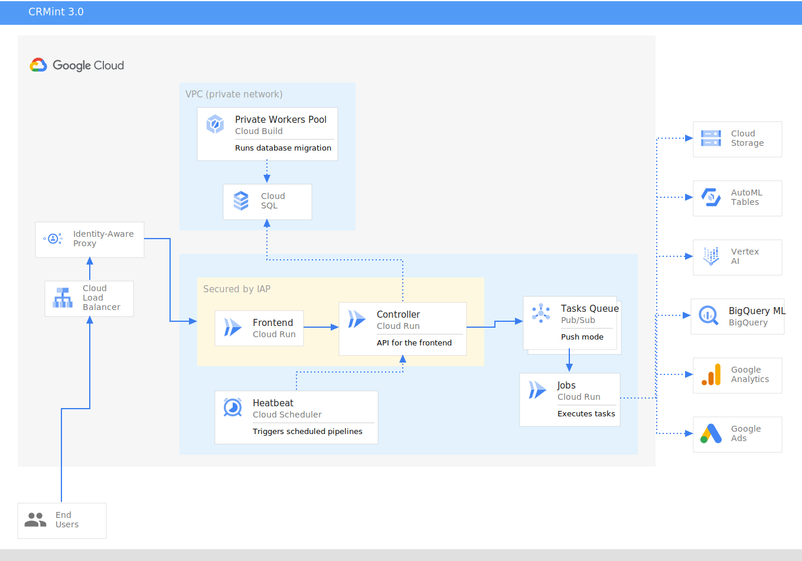

This document describes the CRMint architecture, to enable a better understanding of how it works, and also as a start point for customizing and contributing to the code base.

For more detail on pipelines, jobs, workers, and key concepts of what CRMint does, see the [Concepts](../guides/concepts.html) guide.

## Overview

CRMint is a [Cloud Run](https://cloud.google.com/run/) application, comprising 3 *services*:

*   **[Frontend](#frontend-service)** - service name: `frontend`, which serves the static components that make up the CRMint user interface.
*   **[Controller](#controller-service)** - service name: `controller`, provides the means for the CRMint user interface to interact with the `jobs` service.
*   **[Jobs](#jobs-service)** - service name `jobs`, performs the core actions of executing pipeline tasks.

## Frontend service

The CRMint user interface is an Angular project, and can be found in the [`frontend`](https://github.com/google/crmint/tree/master/frontend) directory.

## Controller service

This service provides the means for the UI to interact with the `jobs` service,
it is the only service which has access to the Cloud SQL instance.

This includes:

*   General settings
*   Global variables
*   Pipeline definitions
*   Job definitions
*   Worker definitions
*   Task execution

You can find its source code in the [`backend/controller`](https://github.com/google/crmint/tree/master/backend/controller) directory.

## Jobs service

Tasks are registered in our Pub/Sub topics. The `jobs` service subscribes to
these topics to receive in push mode the tasks to execute.

Push mode enables our Cloud Run service to automatically detect high-load and
spin up new instances if needed.

This service does not have access to the database, it is solely responsible to
execute tasks and publish success messages back to Pub/Sub.

You can find its source code in the [`backend/jobs`](https://github.com/google/crmint/tree/master/backend/jobs) directory.
