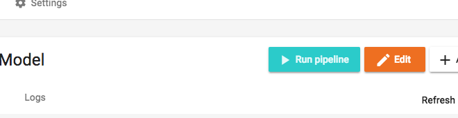

This tutorial introduces CRMint users to implementing a BigQuery ML pipeline from training to predicting. We will deploy a model to predict the price of real-estate in Brasil based on some features of the apartments.

## Before you begin

### Prerequisites

*   About 30 mins of time.
*   A Google Account, for use on the Google Cloud Platform.
*   Working instance of CRMint, if not please read [how to deploy CRMint on GCP](index.html).

### Costs

This tutorial uses billable components of Cloud Platform, including:

* Google BigQuery
* BigQuery ML

You incur charges for:

* [Storing](https://cloud.google.com/bigquery/pricing#active_storage) your ML model and training data in BigQuery
* [Querying](https://cloud.google.com/bigquery/pricing#on_demand_pricing) data in BigQuery
* Running [BigQuery ML SQL statements](https://cloud.google.com/bigquery/pricing#bqml)

## Let's predict the price of houses

The goal of this tutorial is to build a pipeline to predict the price of real estate. We will use data from [Properati](http://properati.com).

### Create a dataset in BigQuery

1.  Enter the name of your project

    <input id="project-id" placeholder="Insert Project ID here, e.g. flying-tiger-112301" data-target-id="gcp-console">

1.  Open your <a id="gcp-console" data-href="https://console.cloud.google.com/bigquery?project=placeholder" target="_blank">BigQuery console</a>

1.  Select your project name on the left sidebar.

1.  Create a **US dataset** with the button on the right **Create Dataset**.

    

1.  Name your dataset `predict_realestate_brasil`, and choose to store the data in the `US` location.

    

1.  Be sure to use the **US** location for your dataset. It's needed because the data source we will use is located in the US.

### Create the training pipeline in CRMint

1.  Open your CRMint instance <a href="https://xxxxxx.appspot.com" id="crm-launch" target="_blank">&lt;Project ID not set&gt;</a>.

1.  Download the pre-built pipeline <a href="https://storage.googleapis.com/crmint-public/templates/pipelines/bqml/train_evaluate_model.json" download target="_blank">train_evaluate_model.json</a>.

1.  Import the pipeline in your CRMint instance with the right **Import** button.

    

1.  Look at the pipeline graph, it contains two nodes:

    * **Train model**: Creates and trains a model based on the data selected by the SQL statement. Click on the node to inspect the content of the BQML query.
    * **Evaluate model**: Runs an `ML.EVALUATE` query once the model is trained, to assess performances.

    The resulting model is stored as part of your BigQuery dataset and is ready for production use as soon as it is trained.

1.  Configure the imported pipeline by clicking the **Edit** button. Fill in the `BQ_PROJECT` parameter with your Cloud Project ID.

    

### Run and check evaluation metrics

1.  Run the pipeline by clicking on the **Start** button.

1.  Be patient, should not take more than a minute or two&hellip;

1.  Explore the results saved in the `price_model_evaluation` table in BigQuery.

### Let's predict some prices

Now that we have a model trained, evaluated and deployed to GCP, we are ready for some predictions!

1.  Import the pre-built pipeline <a href="https://storage.googleapis.com/crmint-public/templates/pipelines/bqml/predict.json" download target="_blank">predict.json</a>.

1.  Look at the pipeline graph, it contains one node:

    * **Get Predictions**: Runs an `ML.PREDICT` query to feed the input features to the model and get back one prediction per row.

1.  Configure the imported pipeline like previously, filling-in the `BQ_PROJECT` parameter.

1.  Run the pipeline.

1.  Once the pipeline has finished (should take a couple minutes), you can [explore the predicted values](https://console.cloud.google.com/bigquery?d=predictions) in the `predict_realestate_brasil.predictions` table.

1.  Congratulations, you now have a new table in BigQuery containing all your predictions!

## What's next

- Schedule this pipeline to run daily.
- Read a full explanation of how CRMint works in [What is CRMint?](../guides/)
  and [CRMint Concepts](../guides/concepts.html)
- CRMint pipeline concepts
