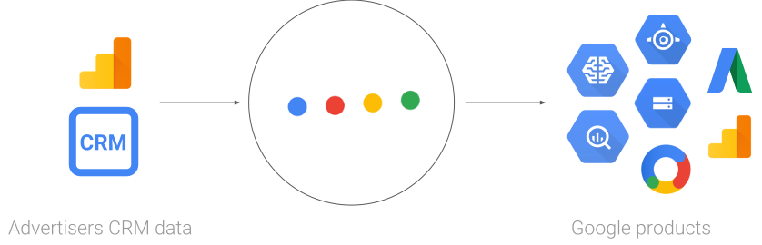

This document introduces you to CRMint, a general overview of use cases and key features of the product.

## Overview
CRMint is a platform to help you bring your business data into Google Products. These products may generally be marketing-related products such as Google Ads and the Google Marketing Platform, but could also include Cloud products, for example.

### Example use cases

Typical use cases for the CRMint platform include:

*   Importing, transforming and building models from your CRM data for use in retargeting.
*   Automating the importing of offline conversions

## The role of CRMint

In this process of bringing your business data to Google products, CRMint can perform the following roles:

*   **Automation**: Often data could be imported manually from sources such as your CRM or Google Analytics, however, CRMint enables you to automate this process, with flexible scheduling options.
*   **Transformation and pre-processing**: Your business data may not be in the format or in the location required for your objectives.

    CRMint allows you to define and run pipelines on your business data with reusable modules - there are many predefined modules for common actions such as exporting Google Analytics reports to BigQuery.

*   **Integration of multiple systems**: Your business data may reside in multiple systems (CRM, Google Analytics) and you may with to combine it with other data (for example, performance statistics from BigQuery, reference data from Cloud Storage) before using this as an input to a Google Cloud ML

    CRMint removes the complexity of integrating with these varied APIs, leaving you to concentrate on the actions taken on the data itself.

## Key features of CRMint

*   **Easy to deploy**: CRMint runs on Google Cloud and can be deployed quickly - see the [Quick start guide for details](../quickstart/).
*   **Cloud-based**: CRMint requires no infrastructure on your part, with all aspects of the platform running in Google Cloud.
*   **Visual pipeline designer**: Once deployed, pipelines can be designed and configured with CRMint's easy-to-use user interface. All aspects of
    pipeline design, configuration and scheduling can be seen and modified in this way.
*   **Reusable pipelines**: Pipeline can be exported and imported in JSON format, allowing for advanced editing, sharing and reuse.
*   **Reusable components**: CRMint pipelines are built from re-usable [worker components](../reference/worker_spec.html), making it easy to plug-and-play as required.
*   **Open source**: CRMint is open source. Users are encouraged to contribute components and pipelines which may be of valuable to others, and CRMint will continue to grow in functionality though this shared contribution!

### What's next

-  [Understand the CRMint concepts](concepts.html)
-  Deploy an existing CRMint pipeline
-  Building a custom CRMint pipeline

